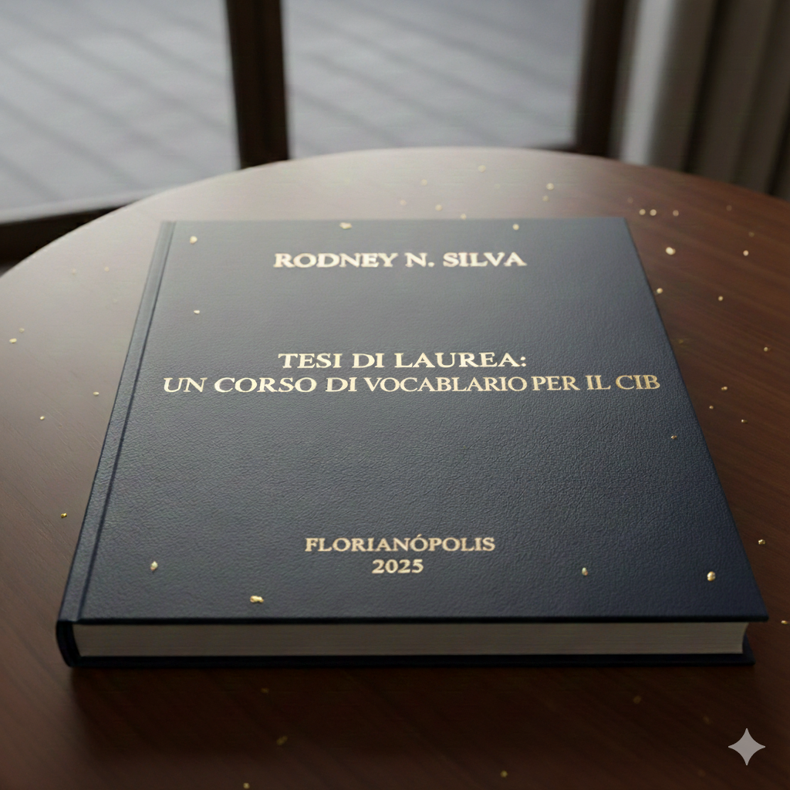

<figure>
  
  <figcaption> </figcaption>
</figure>

  Questa tesi presenta il materiale per un corso di vocabolario, basata sul libro Dizionario per Immagini, con 2000 parole. Si compone di un sito web di studio, un libro testo e un piano didattico lezione per lezione.

[Sito con le parole]( https://rodfloripa.github.io/italiano.github.io/index)

[Libro testo](https://github.com/rodfloripa/italiano.github.io/blob/main/Corso%20Vocabolario.pdf)

[Programma del corso](https://github.com/rodfloripa/italiano.github.io/blob/main/Corso.pdf)
